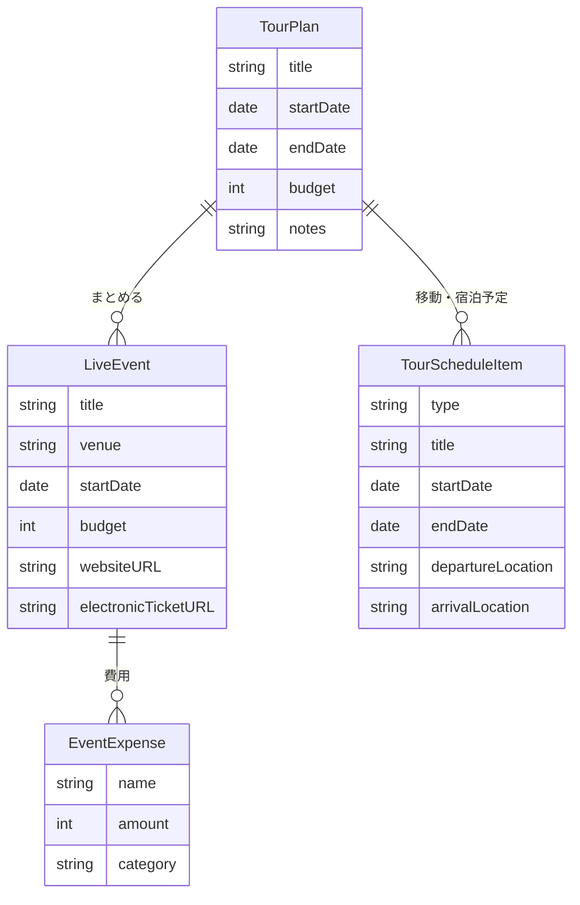

# Event Tour Planner

ライブ・イベント遠征の予定と費用をまとめて管理するiOSアプリです。

イベント単体の開演時間や予算だけでなく、複数イベントをまとめたツアー、移動・宿泊予定まで一つのアプリで確認できます。

## 主な機能

### イベント管理

- ライブイベントの登録・閲覧・編集・削除
- 集合、開場、開演、終演予定時間の管理
- 開演時間を基準にした関連時刻の初期設定
- 会場、公式サイトURL、電子チケットURLの登録
- 詳細画面から登録URLを開く機能

### 予算・費用管理

- イベントごとの予算設定
- 費用の登録・編集・削除
- チケット、交通、宿泊、グッズ、飲食、その他のカテゴリ分類
- 費用名を省略した登録
- 合計支出、予算残額、予算消化率の表示
- Swift Chartsによるカテゴリ別支出の可視化

### ツアー管理

- 複数イベントをまとめるツアーの登録・閲覧・編集・削除
- ツアー期間、予算、メモの管理
- ツアーに含まれるイベントと合計支出の確認
- 移動・宿泊予定の登録・編集・削除
- 出発地、到着地、予約情報、日時、メモの管理
- 登録画面と編集画面で共通の操作を提供

### 操作性

- 端末設定に合わせた日時・通貨・標準メニューの表示
- キーボード内の完了ボタン
- キーボード外タップによる入力終了
- 閲覧画面と編集画面を分離し、意図しない変更を防止

## アーキテクチャ

MVVMにRepositoryパターンを組み合わせ、画面をFeature単位で整理しています。

```text
EventTourPlanner/
├── Features/
│   ├── Events/       # イベント一覧・詳細・編集・ViewModel
│   ├── Expenses/     # 費用編集
│   └── Tours/        # ツアー一覧・詳細・編集・予定編集・ViewModel
├── Models/           # SwiftDataモデルと入力用Draft
├── Repositories/     # データアクセスの抽象化とSwiftData実装
├── Extensions/       # 複数画面で利用するキーボード制御
└── Assets.xcassets/  # AppIcon・AccentColor
```

- **View**: SwiftUIによる表示とユーザー操作
- **ViewModel**: 入力検証、保存処理、画面状態の管理
- **Repository**: 永続化処理を抽象化し、ViewModelからSwiftDataへの直接依存を分離
- **Model**: SwiftDataモデルとモデル間のリレーションを定義

## データ構造



ツアー削除時は移動・宿泊予定を連動して削除し、イベントとの関連は解除します。イベント削除時は、そのイベントに紐づく費用も連動して削除します。

## 使用技術

- Swift 5
- SwiftUI
- SwiftData
- Swift Charts
- XCTest / XCUITest
- Xcode 26.3+
- iOS 17.0+

外部ライブラリは使用していません。

## テスト

ViewModel、モデル、Repository、ツアー予定を対象とした自動テストに加え、主要操作を確認するUIテストを用意しています。

- イベントの登録から詳細表示まで
- ツアーと移動予定の登録から詳細表示まで
- UIテスト実行時はインメモリのSwiftDataを使用し、毎回同じ初期状態で実行

Xcodeでプロジェクトを開き、`⌘ + U` で全テストを実行できます。特定のテストのみ実行する場合は、Test Navigatorで対象テスト横の実行ボタンを押してください。

## 動作方法

1. このリポジトリをクローンします。
2. `EventTourPlanner.xcodeproj` をXcodeで開きます。
3. iOS 17.0以上のシミュレータまたは実機を選択します。
4. `⌘ + R` でアプリを実行します。
